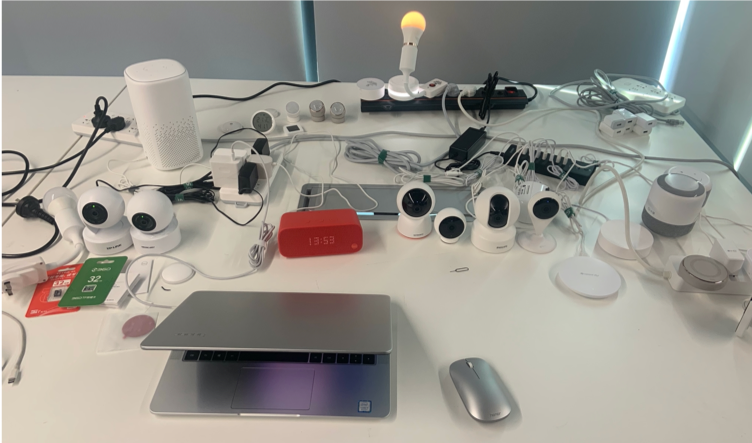
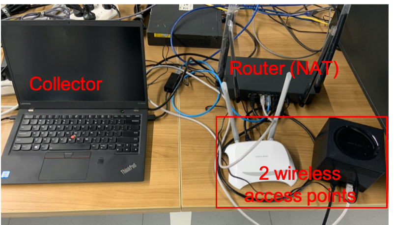

# IoTEnsemble
This repository contains part of the datasets we used in IoTEnsemble (20 TCP/IP based devices, each device selects the first three days of data) and the control scripts for devices.

## About Full Dataset
Due to the laboratory policies, if you need the complete dataset (.pcap format), please send email to huangyc20@mails.tsinghua.edu.cn / yuchenghuang98@126.com with your name and institution.

## Cite Our Data
Li R, Li Q, Huang Y, et al. IoTEnsemble: Detection of Botnet Attacks on Internet of Things[C]//European Symposium on Research in Computer Security. Springer, Cham, 2022: 569-588.

## IoT Testbed
We set up a testbed consisting of 28 IoT devices (20 IP-enabled devices), including cameras, sound boxes, gateways (hubs), plugs, bulbs and many sensors. This testbed is located in our lab and all staff in the lab are free to use them （testbed1.png).



Our goal is to collect the complete traffic of these devices. We use two wireless routers as access points (WAP), because we find our number of devices may exceed the maximum number of connections for one WAP and thus cause losing connections sometimes. Note that these two WAPs do not enable any routing or DHCP functions; they just function like switches. Then the two WAPs are connected to another router. This router functions as the DHCP server that assigns IP addresses to each connected device; it is also a NAT gateway between LAN and WAN. Besides, this router is an enterprise-grade router that supports port mirroring. We mirror the traffic of the two ports that the two WAPs are connected to the third port connected to a computer, which runs a TCPDump script to capture the traffic (testbed2.png).




## Dataset architecture
```
-- device name
  -- year-month-day.pcap (.pcap raw packets saved every day).
```
## Control script description
In addition to the normal use by the staff, we also find a way to automatically trigger the functions of devices. It enables the testbed to present a more functional set of activities and corresponding traffic data.

### Architecture
```
-- controller.py (trigger activities according to activity_list)
-- command
  -- device name
    -- activity script (the activity is triggered via ADB (Android Debug Bridge))
  -- activity_list.csv
```

### How the scripts are written
We use a computer as a controller. This computer is installed with a Andriod emulator that functions like a smart phone. The emulator can be installed with the apps of each device to controll them. To write an automated script, we need to figure out how to trigger the functions by the apps. We use the Android Debug Bridge (adb) to connect with the emulator so that we can monitor its execution. For example, we can know the position of each app by the pixels, and we can know tapping a button/input texts in a box can trigger certain functions. We manually gather such information so that we can write a BASH script like:

```sh
# open app
((x=16#217));((y=16#234))
adb shell input tap $x $y
adb shell sleep 30
# open camera
((x=16#215));((y=16#67b))
adb shell input tap $x $y
adb shell sleep 250
# back home
adb shell input keyevent 3
adb shell sleep 1
# kill app
adb shell am force-stop com.qihoo.camera
```
This scipt opens the app by tapping a certain position of the emulator's desktop and then opens the camera for streaming. At last, it stops the streaming function and goes back to the desktop, making sure the next script can work normally, and kills the app.

We list the functions of the devices in activity_list.csv and use controller.py to run these BASH scripts in certain periods.

### Run code
```sh
python3 controller.py
```
